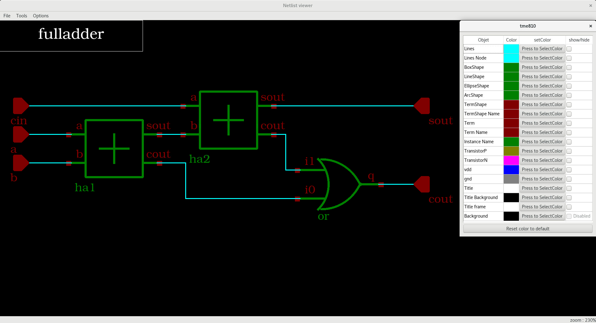

# Netlist Viewer

This application, developed in C++ and using Qt4, allows you to read XML descriptions of digital circuits and display them

## Getting Started

### Required package :
- Qt4
- cmake
- c++ compiler
  
### To run the application, follow these steps:
1. Navigate to the build folder
   ```bash
   cd build
2. Run CMake
   ```bash
   cmake ../src
3. Install the application
   ```bash
   make install
5. Execute the application
   ```bash
   ./tme810


##The application

